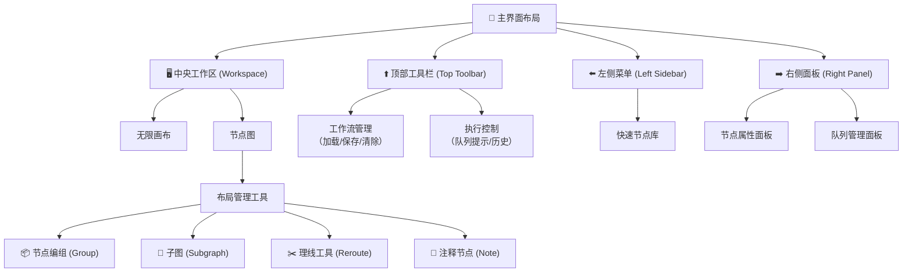

# 节点编辑器实现计划

本计划用于实现 SatExplorer 项目中的基于节点的可视化流程编辑器功能。

## 进度总结（2026-03-12 更新）

- [x] 阶段 1: QtNodes 库集成 - 已完成
- [x] 阶段 2: 基础架构搭建 - 已完成
- [x] 阶段 2.5: 右侧节点面板 - 已完成 ✨（已移至左侧边栏）
- [x] 阶段 3: 数据导入节点实现 - 已完成（Sentinel-1, TerraSAR-X, COSMO-SkyMed, ALOS-2）
- [x] 阶段 4: 预处理节点实现 - 已完成 ✨
- [x] 阶段 2.5.1: 节点调色板顺序功能 - 已完成 ✨（2026-03-12）
- [ ] 阶段 5: 配准节点实现 - 未开始
- [ ] 阶段 6: 干涉处理节点实现 - 未开始
- [ ] 阶段 7: 基线处理节点实现 - 未开始
- [ ] 阶段 8: SBAS 处理节点实现 - 未开始
- [ ] 阶段 9: 可视化节点实现 - 未开始
- [ ] 阶段 10: 工具节点实现 - 未开始
- [x] 阶段 11: 与 MyThread 集成 - 部分完成（导入节点）
- [x] 阶段 12: 保存与加载 - 已完成
- [x] 阶段 13: UI 集成 - 基础完成
- [ ] 阶段 14: 测试与优化 - 部分完成
- [ ] 阶段 15: 文档与示例 - 未开始
- [x] 阶段 16: UI 布局重构 - 已完成 ✨（核心功能，编译成功）
- [x] TSXImportNode UI 对齐主窗口"导入"标签页设计 - 已完成 ✨（2026-03-13）
- [x] TSXBatchImportNode UI 对齐主窗口"批量导入"标签页设计 - 已完成 ✨（2026-03-13）
- [x] CSKImportNode UI 对齐主窗口"批量导入"标签页设计 - 已完成 ✨（2026-03-16）
- [x] ALOS2ImportNode UI 对齐 import_ALOS2.ui 设计 - 已完成 ✨（2026-03-16）

---

## TSXImportNode UI 对齐主窗口"导入"标签页设计（2026-03-13）

**问题描述**：Node Editor 版本的 TSXImportNode 界面与主窗口的 `Import_TSX.ui` 中"导入"标签页设计不一致。

**已完成修改**：
- 头文件 (`include/TSXImportNode.h`)：
  - ✅ 删除 `m_importButton`, `m_stopButton`, `m_statusLabel` 成员变量
  - ✅ 添加 `m_projectCombo`, `m_outputFileNameEdit` 成员变量
  - ✅ 删除 `onImportButtonClicked()`, `onStopButtonClicked()` 槽函数
- 实现文件 (`TSXImportNode.cpp`)：
  - ✅ 添加 UTF-8 BOM 编码指令
  - ✅ 重写 `createWidget()` 方法，使用中文标签和主窗口布局
  - ✅ 删除 `onImportButtonClicked()`, `onStopButtonClicked()` 方法
  - ✅ 修改 `onXmlBrowseClicked()` 使用中文对话框
  - ✅ 修改 `executeImport()` 从 `m_outputFileNameEdit` 获取输出文件名
  - ✅ 修改 `onImportProgress()` 移除状态标签更新
  - ✅ 修改 `onImportFinished()` 移除按钮和状态标签更新

**UI 布局**（与主窗口"导入"标签页一致）：
```
QVBoxLayout (margins=8, spacing=6)
├── QHBoxLayout - TSX/TDX图像（.xml） [Label:LineEdit:Button]
├── QHBoxLayout [3:7] - 目标工程（ComboBox，只读）
├── QHBoxLayout [3:7] - 目标节点
├── QHBoxLayout [3:7] - 目标文件名
├── QHBoxLayout [5:5] - 进度条
└── QHBoxLayout [3:7] - 极化方式
```

---

## TSXBatchImportNode UI 对齐主窗口"批量导入"标签页设计（2026-03-13）

**问题描述**：Node Editor 版本的 TSXBatchImportNode 界面与主窗口的 `Import_TSX.ui` 中"批量导入"标签页设计不一致。

**已完成修改**：
- 头文件 (`include/TSXBatchImportNode.h`)：
  - ✅ 删除 `m_importButton`, `m_stopButton`, `m_statusLabel` 成员变量
  - ✅ 添加 `m_projectCombo` 成员变量
  - ✅ 删除 `onImportButtonClicked()`, `onStopButtonClicked()` 槽函数
- 实现文件 (`TSXBatchImportNode.cpp`)：
  - ✅ 添加 UTF-8 BOM 编码指令
  - ✅ 重写 `createWidget()` 方法，使用中文标签和主窗口布局
  - ✅ 删除 `onImportButtonClicked()`, `onStopButtonClicked()` 方法
  - ✅ 修改 `onAddFilesClicked()` 使用中文对话框
  - ✅ 修改 `onImportProgress()` 移除状态标签更新
  - ✅ 修改 `onImportFinished()` 移除按钮和状态标签更新

**UI 布局**（与主窗口"批量导入"标签页一致）：
```
QVBoxLayout (margins=8, spacing=6) - stretch="4,4"
├── QHBoxLayout (stretch="8,2") - 上半部分：文件列表
│   ├── QListWidget - 文件列表
│   └── QVBoxLayout - 添加/移除按钮
│       ├── QPushButton - "添加"
│       └── QPushButton - "移除"
└── QHBoxLayout - 下半部分：配置选项
    └── QVBoxLayout
        ├── QHBoxLayout [3:7] - 目标工程（ComboBox，只读）
        ├── QHBoxLayout [3:7] - 目标节点
        ├── QHBoxLayout [3:7] - 极化方式
        └── QHBoxLayout [5:5] - 进度条
```

---

## CSKImportNode UI 对齐主窗口"批量导入"标签页设计（2026-03-16）

**问题描述**：Node Editor 版本的 CSKImportNode 界面与主窗口的 `Import_TSX.ui` 中"批量导入"标签页设计不一致。

**已完成修改**：
- 头文件 (`include/CSKImportNode.h`)：
  - ✅ 添加 UTF-8 BOM 编码指令
  - ✅ 添加 `#include <QComboBox>`
  - ✅ 添加 `m_projectCombo` 成员变量
  - ✅ 删除 `onImportButtonClicked()`, `onStopButtonClicked()` 方法声明
- 实现文件 (`CSKImportNode.cpp`)：
  - ✅ 添加 UTF-8 BOM 编码指令
  - ✅ 更新构造函数初始化列表
  - ✅ 重写 `createWidget()` 方法，使用中文标签和主窗口布局
  - ✅ 删除 `onImportButtonClicked()`, `onStopButtonClicked()` 方法
  - ✅ 修改 `onAddFilesClicked()` 使用中文对话框
  - ✅ 修改 `onImportProgress()` 只更新进度条
  - ✅ 修改 `onImportFinished()` 移除状态标签和按钮更新
  - ✅ 修改 `executeImport()` 错误消息为中文
  - ✅ 更新默认节点名称为 "CSK_Batch_Import"

**UI 布局**（与主窗口"批量导入"标签页一致）：
```
QVBoxLayout (margins=8, spacing=6) - stretch="4,4"
├── QHBoxLayout (stretch="8,2") - 上半部分：文件列表
│   ├── QListWidget - 文件列表
│   └── QVBoxLayout - 添加/移除按钮
│       ├── QPushButton - "添加"
│       └── QPushButton - "移除"
└── QHBoxLayout - 下半部分：配置选项
    └── QVBoxLayout
        ├── QHBoxLayout [3:7] - 目标工程（ComboBox，只读）
        ├── QHBoxLayout [3:7] - 目标节点
        └── QHBoxLayout [5:5] - 进度条
```

**文件列表**：
- `include/CSKImportNode.h` - 头文件
- `CSKImportNode.cpp` - 实现文件

---

## ALOS2ImportNode UI 对齐 import_ALOS2.ui 设计（2026-03-16）

**问题描述**：Node Editor 版本的 ALOS2ImportNode 界面与 `import_ALOS2.ui` 设计不一致。

**已完成修改**：
- 头文件 (`include/ALOS2ImportNode.h`)：
  - ✅ 添加 UTF-8 BOM 编码指令
  - ✅ 添加 `#include <QComboBox>`
  - ✅ 添加 `m_projectCombo` 成员变量
  - ✅ 添加 `m_progressText` 成员变量（进度百分比文本标签）
  - ✅ 删除 `onImportButtonClicked()`, `onStopButtonClicked()` 方法声明
- 实现文件 (`ALOS2ImportNode.cpp`)：
  - ✅ 添加 UTF-8 BOM 编码指令
  - ✅ 更新构造函数初始化列表
  - ✅ 重写 `createWidget()` 方法，使用中文标签和 import_ALOS2.ui 布局
  - ✅ 删除 `onImportButtonClicked()`, `onStopButtonClicked()` 方法
  - ✅ 修改 `onAddFilesClicked()` 使用中文对话框
  - ✅ 修改 `onImportProgress()` 同时更新进度条和进度文本
  - ✅ 修改 `onImportFinished()` 设置进度文本为 "100%"
  - ✅ 修改 `executeImport()` 错误消息为中文
  - ✅ 更新默认节点名称为 "ALOS2_Batch_Import"
  - ✅ 添加控件尺寸设置：
    - 目标工程下拉框：`setFixedHeight(32)`, `setMinimumWidth(150)`
    - 目标节点输入框：`setFixedHeight(32)`, `setMinimumWidth(150)`
    - 进度条：`setFixedHeight(20)`, `setTextVisible(false)`
    - 进度文本标签：`setMinimumWidth(50)`, `setFixedHeight(20)`, `setAlignment(Qt::AlignCenter)`
  - ✅ 更新布局比例为 [2:8]（标签20%，控件80%）

**UI 布局**（与 import_ALOS2.ui 一致）：
```
QVBoxLayout (margins=8, spacing=6) - stretch="4,4"
├── QHBoxLayout (stretch="8,2") - 上半部分：文件列表
│   ├── QListWidget - 文件列表
│   └── QVBoxLayout - 添加/移除按钮
│       ├── QPushButton - "添加"
│       └── QPushButton - "移除"
└── QHBoxLayout - 下半部分：配置选项
    └── QVBoxLayout
        ├── QHBoxLayout [2:8] - 目标工程（ComboBox，只读）
        │   └── QComboBox - 固定高度 32px，最小宽度 150px
        ├── QHBoxLayout [2:8] - 目标节点
        │   └── QLineEdit - 固定高度 32px，最小宽度 150px
        └── QHBoxLayout - 进度条和文本
            ├── QProgressBar - 固定高度 20px，隐藏内置文本
            └── QLabel ("0%") - 最小宽度 50px，固定高度 20px，居中对齐
```

**尺寸设置说明**：
- `setFixedHeight(px)` - 设置固定高度
- `setMinimumWidth(px)` - 设置最小宽度，允许扩展
- `setFixedWidth(px)` - 设置固定宽度（通常不建议，让布局自动控制）
- `setAlignment(Qt::AlignCenter)` - 文字居中对齐
- `setTextVisible(false)` - 隐藏进度条内置的百分比文本

**文件列表**：
- `include/ALOS2ImportNode.h` - 头文件
- `ALOS2ImportNode.cpp` - 实现文件

---

## UI 布局设计

### 整体布局结构



### 🖥️ 中央工作区 (Workspace)：主画板

这是整个界面最核心的区域，占据了绝大部分空间，用于构建和管理节点工作流。

- **无限画布**：你可以在一个无限延伸、支持缩放（鼠标滚轮）和平移（按住空格键拖拽或按住鼠标中键拖拽）的灰色网格背景上自由创作。

- **节点图**：所有功能节点和连接线都排列在这里，构成了流程的执行管线。

### ⬆️ 顶部工具栏 (Top Toolbar)：全局控制中心

位于窗口最上方，提供最常用的全局操作入口。

- **工作流管理**：包含"加载工作流"、"保存"、"导出"和"清除"画布等按钮。
  - **Workflow 下拉菜单**：这是工作流管理的起点。
    - **新建空白画布 (Blank)**：创建一个全新的、没有任何节点的工作区。
    - **使用模板 (Default)**：快速加载预设的基础工作流，非常适合新手起步。
    - **打开工作流 (Open)**：加载你保存的或他人分享的 .json 工作流文件。
    - **浏览本地工作流 (Browse)**：直接在工具栏中浏览和管理已保存在本地文件夹中的所有工作流，支持分类和收藏。
    - **收藏夹 (Favorite)**：快速访问你标记为"星标"的常用工作流。
  - **常用操作图标**：紧随下拉菜单之后，通常有一排图标按钮。
    - **保存 (Save)**：将当前工作流保存到默认的用户文件夹。
    - **另存为/导出 (Export)**：将工作流另存为一个新的文件或导出为图片格式（包含工作流信息）。
    - **清空 (Clear)**：一键删除画布上的所有节点，让你重新开始。
    - **刷新 (Refresh)**：刷新节点定义，在安装了新节点后非常有用。

- **执行控制**：核心的"队列提示"按钮就在这里，点击它即可运行当前工作流。"历史记录"按钮则可以让你快速查看最近的生成结果。
  - **执行按钮——核心中的核心**：可以点击按钮本身来**单次执行当前工作流**。更巧妙的是，点击并拖动按钮左侧的**点阵手柄**，可以将其变为一个可任意拖拽的**独立悬浮面板**。通过点击按钮上的小箭头或切换模式，你可以选择：
    - **队列提示 (`Queue Prompt`)**：标准的单次执行
    - **即时队列 (`Queue Instant`)**：开启后，工作流会**自动连续生成**，直到你手动停止
  - **任务控制按钮**
    - **中断 (`Interrupt`)**：立即停止当前正在进行的生成任务
    - **清空队列**：一键清除所有排队等待生成的任务

### ⬅️ 左侧菜单 (Left Sidebar)：快速节点库

默认固定在左侧，用于快速访问常用节点。

这个侧边栏可以通过顶部的图标在几个核心功能间切换，每个功能都旨在解决工作流构建中的一个特定痛点。

| 图标/标签 | 名称                      | 核心功能                                     |
| :-------- | :------------------------ | :------------------------------------------- |
| **📦**     | **节点库 (Node Library)** | 浏览、搜索、管理所有可用节点（核心与自定义） |
| **📄**     | **工作流 (Workflows)**    | 浏览、搜索、管理本地保存的工作流文件         |

- **节点库**：这里整合了系统内置及你通过插件添加的所有节点，支持搜索功能，你可以直接拖拽节点到中央工作区使用。
  - **结构与浏览**：打开节点库，你会看到一个清晰的树状结构，这里包含了所有核心节点。你可以像在文件管理器里一样，逐级展开文件夹来浏览。一个很方便的小技巧是，按住 Ctrl 键点击节点库名称，可以一键展开它的全部子集，方便快速总览。
  - **强大的搜索与筛选**：当节点数量变得庞大时，顶部的搜索框就是你的好帮手。它支持关键词搜索，能帮你快速定位到目标节点。
  - **实用的收藏功能**：对于高频使用的节点，你可以通过点击节点名称旁的星号将其标记为"收藏"。所有被收藏的节点都会出现在顶部的"收藏夹"里，方便随时取用。
  - **添加节点的方式**：找到需要的节点后，只需将其从节点库拖拽到中央画布，即可完成添加。

- **工作流存档**：这个面板帮助你管理自己积累的"配方"。
  - **本地工作流浏览器**：它会列出你保存在本地工作流文件夹中的所有 .json 文件，支持搜索和筛选，方便你快速找到之前搭建好的某个特定方案。
  - **快速加载**：找到目标工作流后，双击它，就可以在一个新的工作流标签页中将其打开并开始使用。

### ➡️ 右侧面板 (Right Panel)：参数与控制中心

默认固定在右侧，是一个多功能面板。这个面板可以通过顶部的图标在两个核心视图间切换，每个视图解决工作流构建中的一个特定需求。

| 图标/标签 | 名称                           | 核心功能                                     |
| :-------- | :----------------------------- | :------------------------------------------- |
| **⚙️**     | **节点属性 (Node Properties)** | 查看和调整选中节点的详细参数、配置节点信息   |
| **📋**     | **队列管理 (Queue Manager)**   | 监控任务执行状态、管理生成历史、快速定位节点 |

- **节点属性面板**：当你选中工作区的某个节点时，这里会显示该节点的所有可调参数，你可以在此进行精细调整。这是你搭建和调试工作流时最常用的面板。
  - **参数一目了然**：无论你选中任何节点，其所有需要设置的参数都会清晰地列在这个面板中。你可以在这里进行精细调整，而无需在节点本身上寻找那些可能被折叠起来的小控件。
  - **配置节点信息**：除了调整参数，你还可以在此面板中查看或修改节点的基本属性。例如，你可以看到节点的唯一ID，或者为节点添加自定义名称，这在复杂工作流中快速定位特定节点时非常有用。

- **队列管理面板**：切换到该视图，可以实时查看当前任务的执行状态和进度。将生成历史和任务管理整合到了一起。

### 🧰 布局管理工具：让工作流井然有序

除了固定的面板，还提供了一套强大的布局管理工具，帮助你整理日益复杂的节点图。

#### 1. 节点编组 (Grouping)：视觉归类与整体移动

你可以将功能相关的节点框选（Ctrl + G），形成一个可命名的半透明色块。之后拖动这个组的标题栏，就能整体移动组内的所有节点，非常方便。

#### 2. 子图 (Subgraph)：封装复用，打造个人模块

这是比"编组"更高级的功能。你可以将一组功能完整的节点打包成一个全新的、可自定义接口的"超级节点"。

- **创建与编辑**：选中节点后，通过右键菜单即可创建子图。双击子图可以进入其内部进行编辑，通过顶部的导航栏可以随时返回上级。

- **参数面板**：你可以在不进入子图内部的情况下，直接在外部的参数面板中调整子图的控件顺序和可见性，非常方便。

- **发布与复用**：你甚至可以将制作好的子图"发布"到左侧的节点库中，像使用普通节点一样，在任何新工作流中随时调用它。

#### 3. 理线工具 (Reroute)：让连线清晰可读

当一根线需要连接多个节点时，画面会显得很乱。使用 Add Reroute 功能，可以创建一个"中转站"，就像集线器一样，让多根线汇集到一起再分散出去，大大提升可读性。你还可以在设置中将连线修改为看起来最整洁的直角线型。

#### 4. 注释节点 (Note)：添加说明文档

在空白处双击搜索"Note"即可添加注释节点。它是一个 Markdown 文本编辑器，你可以在里面写下对工作流某个部分的解释、注意事项等，方便自己日后回顾或分享给别人。

---

## 已完成的工作（2026-03-12 更新）

### 节点调色板顺序功能（阶段 2.5.1 - 已完成）✨

**日期**：2026-03-12

**问题描述**：节点库中的节点显示顺序不是完全按照 `getPaletteFullOrder()` 中定义的顺序进行的。

**原因分析**：
1. `populateNodeTree()` 完全没有使用 `m_paletteOrder` 来控制显示顺序
2. 使用 `QMap`（按键字母顺序排序）而不是调色板顺序
3. 叶子项按字母顺序排序，而不是使用 `m_paletteOrder.leafItems` 顺序
4. 使用路径最后一部分作为显示名称，而不是节点的 `caption()` 返回值

**修复内容**：

#### 1. 修复拼写错误 (DockWidgets.cpp)
- ✅ `Qt::ItemariIsEnabled` → `Qt::ItemIsEnabled`
- ✅ `*itit` → `*it`
- ✅ `populate populateNodeTree()` → `populateNodeTree()`
- ✅ `prop->setPlaceholderText` → `propEdit->setPlaceholderText`

#### 2. 创建调色板顺序结构 (include/PaletteOrder.h)
```cpp
struct PaletteOrder {
    QStringList topLevel;              // 顶级分类顺序
    QMap<QString, QStringList> subcategories;  // 顶级 -> 子分类顺序
    QMap<QString, QStringList> leafItems;      // 子分类路径 -> 叶子项顺序
};
```

#### 3. 修改 NodeLibraryWidget::populateNodeTree()
- ✅ 获取每个模型的 `caption()` 作为显示名称
- ✅ 按照 `m_paletteOrder.topLevel` 遍历顶级分类
- ✅ 按照 `m_paletteOrder.subcategories` 遍历子分类
- ✅ 按照 `m_paletteOrder.leafItems` 遍历叶子节点
- ✅ 使用 caption 与调色板顺序匹配

#### 4. 更新 getPaletteFullOrder() 的叶子项
使用实际的 caption 值：
- **Test 分类**：`"Source"`, `"Display"`, `"Math (Concat)"`
- **Data Import/Sentinel-1**：`"Sentinel-1 Import"`, `"Sentinel-1 Batch Import"`
- **Data Import/TerraSAR-X**：`"TerraSAR-X Import"`, `"TerraSAR-X Batch Import"`
- **Data Import/COSMO-SkyMed**：`"COSMO-SkyMed Import"`
- **Data Import/ALOS-2**：`"ALOS-2 Import"`
- **Preprocessing/Sentinel-1**：`"S1 Deburst"`, `"S1 Frame Merge"`, `"S1 Swath Merge"`

**文件列表**：
- `include/PaletteOrder.h` - 调色板顺序结构定义（新建）
- `include/DockWidgets.h` - 添加 `setPaletteOrder()` 方法和 `m_paletteOrder` 成员
- `DockWidgets.cpp` - 修改 `populateNodeTree()` 实现调色板顺序
- `NodeEditorWindow.cpp` - 更新 `getPaletteFullOrder()` 使用实际 caption 值

---

### 预处理节点（阶段 4 - 已完成）✨

### 预处理节点（阶段 4 - 已完成）✨

**已实现节点**：
- S1 Deburst 节点 (`S1DeburstNode`)
- S1 Frame Merge 节点 (`S1FrameMergeNode`)
- S1 Swath Merge 节点 (`S1SwathMergeNode`)

**注册位置**：`NodeModels.cpp` 中的 `registerInSARNodeModels()` 函数

**面板配置**：`NodeEditorWindow.cpp` 中的 `getPaletteFullOrder()` 函数
- 添加了 "Preprocessing" 顶级分类
- 添加了 "Sentinel-1" 子分类
- 添加了三个叶子项：Deburst, Frame Merge, Swath Merge

**数据类型**：使用 `ImportedFileData` 作为输入/输出类型（包含 filePath 和 nodeName）

**文件列表**：
- `include/S1DeburstNode.h` - S1DeburstNode 头文件
- `S1DeburstNode.cpp` - S1DeburstNode 实现
- `include/S1FrameMergeNode.h` - S1FrameMergeNode 头文件
- `S1FrameMergeNode.cpp` - S1FrameMergeNode 实现
- `include/S1SwathMergeNode.h` - S1SwathMergeNode 头文件
- `S1SwathMergeNode.cpp` - S1SwathMergeNode 实现

**S1DeburstNode 功能**：
- 1 个输入端口，1 个输出端口
- 输出节点名称参数（自动生成默认值）
- 调用 `MyThread::S1_Deburst(savePath, dstProject, srcNode, dstNode, model)`
- 显示输入数据信息
- 进度条和状态标签
- 处理/停止按钮

**S1FrameMergeNode 功能**：
- 2 个输入端口，1 个输出端口
- 两个图像索引参数（QSpinBox，默认 1）
- 输出节点名称参数（自动生成默认值）
- 调用 `MyThread::S1_frame_merge(index1, index2, projectName, srcNode1, srcNode2, dstNode, model)`
- 显示两个输入数据信息
- 进度条和状态标签
- 处理/停止按钮

**S1SwathMergeNode 功能**：
- 3 个输入端口，1 个输出端口
- 三个图像索引参数（QSpinBox，默认 1）
- 输出节点名称参数（自动生成默认值）
- 调用 `MyThread::S1_swath_merge(index1, index2, index3, projectName, srcNode1, srcNode2, srcNode3, dstNode, model)`
- 显示三个输入数据信息
- 进度条和状态标签
- 处理/停止按钮

---

### UI 布局重构（阶段 16 - 已完成）✨

**日期**：2026-03-10

**实现内容**：

#### 1. 核心布局重构
- ✅ 创建 `include/LeftSidebar.h` - 左侧边栏框架类
- ✅ 创建 `LeftSidebar.cpp` - 左侧边栏实现（节点库 + 工作流标签页）
- ✅ 创建 `include/RightPanel.h` - 右侧面板框架类
- ✅ 创建 `RightPanel.cpp` - 右侧面板实现（属性编辑器 + 队列管理标签页）
- ✅ 修改 `NodeEditorWindow::setupUi()` 实现三栏布局：[左侧边栏] [中央工作区] [右侧面板]
- ✅ 将现有 `NodeTreeWidget` 从 NodeEditorWindow 迁移到 LeftSidebar

#### 2. 左侧边栏实现
- ✅ 实现节点库标签页（搜索、拖拽、折叠/展开）
- ✅ 实现工作流标签页（WorkflowBrowser，本地 .json 文件扫描）
- ✅ 标签页切换功能

**文件列表**：
- `include/LeftSidebar.h` - 左侧边栏头文件
- `LeftSidebar.cpp` - 左侧边栏实现

#### 3. 右侧面板实现
- ✅ 节点属性标签页（查看/编辑选中节点参数）
- ✅ 属性编辑器实现（ID、位置、标题、嵌入控件同步）
- ✅ 队列管理标签页（占位符框架）

**文件列表**：
- `include/RightPanel.h` - 右侧面板头文件
- `RightPanel.cpp` - 右侧面板实现
- `include/PropertyEditor.h` - 属性编辑器头文件
- `PropertyEditor.cpp` - 属性编辑器实现
- `include/QueueManager.h` - 队列管理器头文件
- `QueueManager.cpp` - 队列管理器实现

#### 4. 顶部工具栏增强
- ✅ Workflow 下拉菜单（空白、默认、打开）
- ✅ 浏览按钮、收藏夹按钮、刷新按钮
- ✅ 队列执行按钮、中断按钮、清空队列按钮
- ✅ 历史记录按钮
- ✅ 重新组织工具栏布局

#### 5. 布局管理工具（核心功能）
- ✅ 节点编组功能 (Ctrl+G)
  - ✅ 创建 `include/NodeGroupManager.h`
  - ✅ 创建 `NodeGroupManager.cpp`
  - ✅ 在 `GraphicsView` 中实现 Ctrl+G 快捷键
  - ✅ 实现组数据结构和组操作接口

**文件列表**：
- `include/NodeGroupManager.h` - 节点编组管理器头文件
- `NodeGroupManager.cpp` - 节点编组管理器实现
- `QtNodes/src/GraphicsView.hpp` - 添加 groupSelectionAction
- `QtNodes/src/GraphicsView.cpp` - 实现 Ctrl+G 快捷键

- ✅ 注释节点 (NoteNode)
  - ✅ 创建 `include/NoteNode.h`
  - ✅ 创建 `NoteNode.cpp`
  - ✅ 实现 QTextEdit 作为嵌入控件
  - ✅ 设置独特颜色（黄色背景）
  - ✅ 在 `NodeModels.cpp` 中注册节点

**文件列表**：
- `include/NoteNode.h` - 注释节点头文件
- `NoteNode.cpp` - 注释节点实现

---

### UI 布局重构计划（2026-03-10 新增）

**目标**：根据 `布局设计.md` 更新节点编辑器 UI。

**当前实现与设计差异分析**：

| 组件 | 当前状态 | 设计需求 | 差异 |
|------------|---------------|-------------------|------|
| **中央工作区** | 无限画布、缩放、平移、节点图 | 相同 | ✅ 已实现 |
| **顶部工具栏** | 基础（新建、保存、加载、清除、删除、退出） | Workflow 下拉、队列控制、历史、刷新、浏览、收藏 | ⚠️ 60% 完成 |
| **左侧边栏** | 未实现 | 节点库标签页 + 工作流标签页 | ❌ 未实现 |
| **右侧边栏** | 节点面板（位置错误） | 应为空或属性面板 | ⚠️ 位置需调整 |
| **右侧面板** | 未实现 | 节点属性标签页 + 队列管理标签页（占位符）| ❌ 未实现 |
| **布局工具** | 无 | 节点编组(Ctrl+G)、注释节点 - *子图/理线延后* | ❌ 未实现 |

**优先级说明**：
- 核心功能：节点编组 (Ctrl+G)、注释节点 - **必须实现**
- 延后功能：子图、连接路由选项 - 暂不实现
- 队列管理：仅创建占位符框架

**详细实现计划**：见下方"阶段 16: UI 布局重构"

---

### 数据导入节点（阶段 3 - 已完成）

**已实现节点**：
- Sentinel-1 单文件导入节点 (`Sentinel1ImportNode`)
- Sentinel-1 批量导入节点 (`Sentinel1BatchImportNode`)
- TerraSAR-X 单文件导入节点 (`TSXImportNode`)
- TerraSAR-X 批量导入节点 (`TSXBatchImportNode`)
- COSMO-SkyMed 批量导入节点 (`CSKImportNode`)
- ALOS-2 批量导入节点 (`ALOS2ImportNode`)

**注册位置**：`NodeModels.cpp` 中的 `registerInSARNodeModels()` 函数

### 右侧节点面板（阶段 2.5 - 已完成）

**文件**: `include/NodeEditorWindow.h`, `NodeEditorWindow.cpp`

**功能**:
- 右侧节点面板显示节点分类树
- 搜索框支持过滤节点列表
- 双击节点项添加到画布中心
- 拖拽节点到画布任意位置添加
- 折叠/展开功能（Adobe 风格 dock 风格）
- 3D 边框效果

**实现类**:
- `NodeTreeWidget` - 继承 QTreeWidget，支持拖拽
- `PaletteGraphicsView` - 继承 GraphicsView，接受拖放

**拖拽 MIME 格式**: `application/x-node-palette`

**面板结构优化**:
- 修正为正确的 3 级层级结构
- 实现了 `PaletteOrder` 结构体统一管理所有级别顺序
- 在 `getPaletteFullOrder()` 函数中修改顺序即可

**拖拽实现优化**:
- 使用 `setDragEnabled(false)` + 手动拖拽处理
- 距离检测：鼠标移动超过 10 像素才启动拖拽
- 分类项（有子项的）不能被拖拽
- 叶子项（没有子项的）可以被拖拽

**折叠/展开修复**:
- 修复了双击导致折叠/展开失效的问题
- 添加了 `mouseDoubleClickEvent()` 处理
- 禁用 Qt 内置拖拽，避免与折叠/展开冲突

**编码修复**:
- 为 `NodeEditorWindow.h` 和 `NodeEditorWindow.cpp` 添加 UTF-8 BOM
- 文件保存为 Unicode 格式，可以安全使用中文注释

---

### QtNodes 库集成（阶段 1 - 已完成）
   - QtNodes 源代码通过静态链接方式完全集成到项目中
   - 所有 QtNodes 源文件在 `QtNodes/src/` 目录下
   - 所有 QtNodes 头文件在 `include/QtNodes/internal/` 目录下
   - 在 `QtWidgetsApplication3.vcxproj` 中正确配置：
     - QtNodes 的 `.cpp` 文件添加到 `<ClCompile>` 列表
     - QtNodes 的 `.hpp` 文件添加到 `<ClInclude>` 列表
     - 包含 `Q_OBJECT` 宏的头文件添加到 `<QtMoc>` 处理列表
     - `Definitions.hpp`（包含 `Q_NAMESPACE`）添加到 `<QtMoc>`

2. **NodeEditorWindow 窗口类（阶段 2.1 - 已完成）**
   - `NodeEditorWindow.h` - 完整的头文件定义
   - `NodeEditorWindow.cpp` - 完整的实现，包括：
     - 工具栏（新建、保存、加载、清除、删除、退出按钮）
     - 菜单栏（文件、编辑、帮助菜单）
     - 场景和视图初始化
     - 保存/加载 JSON 格式的流程图
     - 深色主题样式配置
     - 状态栏显示节点和连接数量
     - **项目上下文传递**（setProjectContext, projectModel, projectPath, projectName）

3. **NodeDataTypes 自定义数据类型（阶段 2.2 - 已完成）**
   - `ImageData` - SAR 图像数据
   - `MetadataData` - 元数据
   - `BaselineData` - 基线数据
   - `PairListData` - 干涉对列表
   - `TimeSeriesData` - 时间序列数据
   - `CoordinateMatrixData` - 坐标变换矩阵

4. **NodeModels 节点模型注册表（阶段 2.3 - 已完成）**
   - `NodeModels.h` - 注册表接口定义
   - `NodeModels.cpp` - 包含注册表实现：
     - `registerTestNodeModels()` - 返回测试节点注册表
     - `registerInSARNodeModels()` - 返回 InSAR 节点注册表（包含 Sentinel-1 节点）

5. **UI 集成（阶段 13 - 已完成）**
   - MainWindow.h 中声明了 `on_actionNodeEditor_triggered()` 槽函数
   - MainWindow.cpp:666-680 中实现了打开 NodeEditorWindow 的逻辑
   - 节点编辑器可作为独立窗口打开
   - **传递当前项目上下文到节点编辑器**

6. **数据导入节点实现（阶段 3 - 已完成）**
   - **`ImportDataTypes.h`** - 导入节点数据类型
     - `ImportedFileData` - 已导入文件数据类型（包含文件路径和节点名）

   - **`ImportNodeBase.h/cpp`** - 导入节点基类
     - 通用端口配置（无输入，单输出）
     - 项目上下文获取方法（projectModel, projectPath, projectName）
     - 进度更新和状态管理
     - 与 NodeEditorWindow 的集成接口

   - **`Sentinel1ImportNode.h/cpp`** - Sentinel-1 单文件导入节点
     - Manifest 文件选择
     - POD 文件选择（可选）
     - 子波束选择下拉框（iw1/iw2/iw3）
     - 极化方式下拉框（vv/vh）
     - 进度条和状态标签
     - 与 MyThread::import_sentinel 集成

   - **`Sentinel1BatchImportNode.h/cpp`** - Sentinel-1 批量导入节点
     - 文件列表控件（显示多个 manifest 路径）
     - 添加/删除文件按钮
     - 子波束和极化共享设置
     - 与 MyThread::import_sentinel_patch 集成

   - **`TSXImportNode.h/cpp`** - TerraSAR-X 单文件导入节点
     - XML 文件选择
     - 极化方式下拉框（hh/hv/vh/vv）
     - 进度条和状态标签
     - 与 MyThread::import_TSX 集成

   - **`TSXBatchImportNode.h/cpp`** - TerraSAR-X 批量导入节点
     - 文件列表控件
     - 添加/删除文件按钮
     - 共享极化设置
     - 与 MyThread::import_TSX 批量调用集成

   - **`CSKImportNode.h/cpp`** - COSMO-SkyMed 批量导入节点
     - 文件列表控件（H5 文件）
     - 添加/删除文件按钮
     - 进度条和状态标签
     - 与 MyThread::import_CSK 集成

   - **`ALOS2ImportNode.h/cpp`** - ALOS-2 批量导入节点
     - 文件列表控件（IMG 文件）
     - 添加/删除文件按钮
     - 进度条和状态标签
     - 与 MyThread::import_ALOS2 集成

7. **Bug 修复记录（2026-03-04）**

   - **删除功能修复**：
     - 修改 `NodeEditorWindow::onDelete()` 实现真正的删除功能
     - 调用 `m_scene->selectedNodes()` 获取选中节点
     - 调用 `m_graphModel->deleteNode()` 删除节点

   - **Mac 删除快捷键修复**：
     - 修改 `QtNodes/src/GraphicsView.cpp` 中的删除快捷键
     - 同时支持 Delete 键（Windows）和 Backspace 键（Mac）
     - 将快捷键作用域从 WidgetShortcut 改为 WindowShortcut

   - **Widget 清理修复**：
     - 从 `Sentinel1ImportNode` 析构函数移除 `delete m_widget;`
     - 从 `Sentinel1BatchImportNode` 析构函数移除 `delete m_widget;`
     - QtNodes 通过 QGraphicsProxyWidget 管理 widget 生命周期，不应手动删除

### 当前限制

1. **处理节点未完全实现**：已实现所有导入节点和 Sentinel-1 预处理节点（Deburst, Frame Merge, Swath Merge），但配准、干涉等处理节点尚未实现
2. **UI 样式未优化**：节点界面使用默认样式，未应用深色主题
3. **与项目树集成不完整**：节点输出不会自动添加到项目树
4. **实际数据处理未验证**：虽然实现了与 MyThread 的接口，但尚未用真实数据测试

### 编译错误修复记录（2025-02-27）

修复了 QtNodes 集成过程中的编译和链接错误：

1. **Qt MOC 错误修复**：
   - 将包含 `Q_OBJECT` 宏的 QtNodes 头文件添加到 `<QtMoc>` 处理列表：
     - `AbstractGraphModel.hpp` - 抽象图模型基类
     - `BasicGraphicsScene.hpp` - 基础图形场景
     - `ConnectionGraphicsObject.hpp` - 连接图形对象
     - `DataFlowGraphicsScene.hpp` - 数据流图形场景
     - `DataFlowGraphModel.hpp` - 数据流图模型
     - `GraphicsView.hpp` - 图形视图
     - `NodeDelegateModel.hpp` - 节点代理模型
     - `NodeGraphicsObject.hpp` - 节点图形对象
   - 移除了 `Style.hpp`（Q_OBJECT 已被注释）

2. **Q_NAMESPACE 错误修复**：
   - 将 `Definitions.hpp` 从 `<ClInclude>` 移至 `<QtMoc>`，该文件包含 `Q_NAMESPACE` 和 `Q_ENUM_NS` 宏
   - 这解决了 Qt 5.15.2 中命名空间元对象的链接错误

3. **Qt 资源编译错误修复**：
   - 使用 Qt rcc 工具手动生成 `qrc_QtWidgetsApplication3.cpp`
   - 将生成的文件添加到 `<ClCompile>` 列表
   - 从 `<None>` 中移除重复的 qrc 文件引用
   - 这解决了 `qInitResources_QtWidgetsApplication3` 未定义的链接错误

4. **项目文件修改**：
   - 修改 `QtWidgetsApplication3.vcxproj` 添加上述 MOC 和资源配置

---

## 阶段 1: QtNodes 库集成

### 1.1 构建或获取 QtNodes 库
- [x] 检查 `D:\SRC\nodeeditor` 是否已构建完成
- [x] 如未构建，执行 CMake 构建命令生成 QtNodes 库文件
- [x] 确认库文件位置（Debug: `QtNodes_d.lib`, Release: `QtNodes.lib`）

### 1.2 修改项目文件集成 QtNodes
- [x] 编辑 `QtWidgetsApplication3.vcxproj`
- [x] 添加 `D:\SRC\nodeeditor\include` 到 AdditionalIncludeDirectories
- [x] 添加 QtNodes 源文件到项目（或配置为库链接）
- [x] 添加 QtNodes 库目录和库名称到 Linker 配置
- [x] 确保 Qt 相关模块（core, gui, widgets）已配置

### 1.3 验证集成
- [x] 尝试编译项目，确认无编译错误
- [x] 添加简单的测试代码，确认 QtNodes 头文件可以正常引用

## 阶段 2: 基础架构搭建

### 2.1 创建节点编辑器窗口类
- [x] 创建 `include\NodeEditorWindow.h`
- [x] 创建 `NodeEditorWindow.cpp`
- [x] 继承 QMainWindow，设计基本布局
- [x] 添加工具栏（新建、保存、加载、清除、删除、退出按钮）
- [x] 添加 central widget 容器用于 GraphicsView
- [x] 实现场景和视图初始化
- [x] 实现保存/加载 JSON 格式流程图
- [x] 应用深色主题样式
- [x] 添加项目上下文传递接口

### 2.2 创建自定义数据类型文件
- [x] 创建 `include\NodeDataTypes.h`
- [x] 实现 `ImageData` 类（SAR 图像数据）
- [x] 实现 `MetadataData` 类（元数据）
- [x] 实现 `BaselineData` 类（基线数据）
- [x] 实现 `PairListData` 类（干涉对列表）
- [x] 实现 `TimeSeriesData` 类（时间序列数据）
- [x] 实现 `CoordinateMatrixData` 类（坐标变换矩阵）
- [x] 实现 `ImportedFileData` 类（已导入文件数据）

### 2.3 创建节点模型基类和注册表
- [x] 创建 `include\NodeModels.h`
- [x] 创建 `NodeModels.cpp`
- [x] 定义 InSAR 节点注册表初始化函数
- [x] 实现 `registerInSARNodeModels()` 函数（已注册 Sentinel-1 节点和测试节点）
- [x] 创建示例测试节点以验证编辑器功能

**测试节点已创建：**
- `TestNodes.h` - 测试节点头文件
- `TestNodes.cpp` - 测试节点实现
  - `SimpleSourceNode` - 源节点（输出固定值）
  - `SimpleMathNode` - 数学节点（连接两个输入）
  - `SimpleDisplayNode` - 显示节点

**测试方法：**
1. 打开节点编辑器（菜单 → 节点编辑器）
2. **双击**或**拖拽**右侧面板中的节点到画布
3. 连接节点：拖拽输出端口到输入端口
4. 选中节点后点击工具栏的 Delete 按钮（或按 Delete/Backspace 键）删除节点
5. 使用搜索框过滤节点列表
6. 点击面板右上角折叠按钮测试折叠/展开功能

## 阶段 3: 数据导入节点实现

### 3.1 导入节点基类
- [x] 创建 `ImportNodeBase` 抽象基类
- [x] 实现文件选择对话框
- [x] 实现进度更新信号
- [x] 实现项目上下文获取方法

### 3.2 Sentinel-1 导入节点
- [x] 创建 `Sentinel1ImportNode` 类
- [x] 实现 POD 文件选择
- [x] 实现 manifest 文件选择
- [x] 实现子波束和极化参数设置
- [x] 调用 MyThread::import_sentinel 方法
- [x] 实现文件名自动生成

### 3.3 Sentinel-1 批量导入节点
- [x] 创建 `Sentinel1BatchImportNode` 类
- [x] 实现文件列表管理（添加/删除）
- [x] 实现子波束和极化参数设置
- [x] 调用 MyThread::import_sentinel_patch 方法

### 3.4 TSX 导入节点
- [x] 创建 `TSXImportNode` 类
- [x] 创建 `TSXBatchImportNode` 类
- [x] 实现 XML 文件选择
- [x] 实现极化参数设置
- [x] 调用 MyThread::import_TSX 方法

### 3.5 其他导入节点
- [x] 创建 `CSKImportNode` 类
- [x] 创建 `ALOS2ImportNode` 类
- [x] 实现各自的参数设置界面

## 阶段 4: 预处理节点实现

### 4.1 S1 Deburst 节点
- [x] 创建 `S1DeburstNode` 类
- [x] 实现输入输出端口（ImportedFileData）
- [x] 调用 MyThread::S1_Deburst 方法
- [x] 添加到右侧面板

### 4.2 S1 帧拼接节点
- [x] 创建 `S1FrameMergeNode` 类
- [x] 实现多输入端口（2个 ImportedFileData）
- [x] 实现索引参数设置
- [x] 调用 MyThread::S1_frame_merge 方法
- [x] 添加到右侧面板

### 4.3 S1 条带拼接节点
- [x] 创建 `S1SwathMergeNode` 类
- [x] 实现多输入端口（3个 ImportedFileData）
- [x] 调用 MyThread::S1_swath_merge 方法
- [x] 添加到右侧面板

## 阶段 5: 配准节点实现

### 5.1 几何配准节点
- [ ] 创建 `RegistrationNode` 类
- [ ] 实现多输入端口（多个 ImageData）
- [ ] 实现配准参数设置（主图像索引、插值次数等）
- [ ] 调用 MyThread::Regis 方法
- [ ] 输出: ImageData + CoordinateMatrixData

### 5.2 S1 BackGeocoding 节点
- [ ] 创建 `S1BackGeocodingNode` 类
- [ ] 实现参数设置（图像数量、主图像索引、ESD开关）
- [ ] 调用 MyThread::S1_TOPS_BackGeocoding 方法

## 阶段 6: 干涉处理节点实现

### 6.1 干涉图生成节点
- [ ] 创建 `InterferogramNode` 类
- [ ] 实现 2 输入（主从图像）
- [ ] 实现参数设置（去平、地形相位、相干性等）
- [ ] 调用 MyThread::Interferometric 方法

### 6.2 滤波节点
- [ ] 创建 `FilterNode` 类
- [ ] 实现滤波类型选择（Goldstein、基于斜率）
- [ ] 实现参数设置（窗口大小、alpha 值）
- [ ] 调用 MyThread::Denoise 方法

### 6.3 相位解缠节点
- [ ] 创建 `UnwrapNode` 类
- [ ] 实现解缠方法选择（MCF、SNAPHU）
- [ ] 实现参数设置（相干性阈值等）
- [ ] 调用 MyThread::QUnwrap 方法

### 6.4 DEM 生成节点
- [ ] 创建 `DemNode` 类
- [ ] 实现参数设置
- [ ] 调用 MyThread::QDem 方法

## 阶段 7: 基线处理节点实现

### 7.1 基线估计节点
- [ ] 创建 `BaselineNode` 类
- [ ] 实现多输入（多个 ImageData）
- [ ] 调用 MyThread::Baseline_Estimate 方法
- [ ] 输出: BaselineData

### 7.2 基线组生成节点
- [ ] 创建 `BaselineFormationNode` 类
- [ ] 实现 ImageData + BaselineData 输入
- [ ] 实现参数设置（主图像索引）
- [ ] 调用 MyThread::Baseline_Formation 方法
- [ ] 输出: PairListData

## 阶段 8: SBAS 处理节点实现

### 8.1 时间序列分析节点
- [ ] 创建 `SBASTimeSeriesNode` 类
- [ ] 实现多参数设置（时间阈值、空间阈值、多视等）
- [ ] 实现解缠方法选择
- [ ] 调用 MyThread::SBAS_time_series 方法
- [ ] 输出: TimeSeriesData

### 8.2 参考点重选节点
- [ ] 创建 `SBASReferenceReselectionNode` 类
- [ ] 实现参考点坐标设置
- [ ] 实现 GCPs 设置
- [ ] 调用 MyThread::SBAS_reference_reselection 方法

## 阶段 9: 可视化节点实现

### 9.1 图像显示节点
- [ ] 创建 `DisplayNode` 类
- [ ] 实现 ImageData 输入
- [ ] 集成现有的 ImageView 和 ColorBar 组件
- [ ] 在节点中嵌入预览控件

### 9.2 变形预览节点
- [ ] 创建 `DeformationPreviewNode` 类
- [ ] 实现 TimeSeriesData 输入
- [ ] 集成现有的 Deformation_Preview_Window

### 9.3 基线预览节点
- [ ] 创建 `BaselinePreviewNode` 类
- [ ] 实现 BaselineData 输入
- [ ] 集成现有的 Baseline_Preview

## 阶段 10: 工具节点实现

### 10.1 裁剪节点
- [ ] 创建 `CutNode` 类
- [ ] 实现参数设置（经纬度范围或像素范围）
- [ ] 调用 MyThread::Cut 或 MyThread::Cut2 方法

### 10.2 地理编码节点
- [ ] 创建 `GeocodingNode` 类
- [ ] 实现类型选择（产品/图像）
- [ ] 调用 MyThread::Geocoding 方法

## 阶段 11: 与 MyThread 集成

### 11.1 异步处理集成
- [x] 为导入节点实现独立 MyThread 实例
- [ ] 将节点处理操作转移到后台线程
- [x] 实现进度信号从节点到界面的传递
- [x] 实现取消操作机制

### 11.2 错误处理
- [x] 为导入节点添加错误处理逻辑
- [x] 实现错误信号传递
- [x] 在界面上显示错误信息

## 阶段 12: 保存与加载

### 12.1 流程保存
- [x] 实现从图模型生成 JSON（NodeEditorWindow.cpp:229-245）
- [ ] 扩展现有的 XML 项目格式以包含流程图
- [ ] 实现流程保存到项目文件

### 12.2 流程加载
- [x] 实现从 JSON 恢复图模型（NodeEditorWindow.cpp:247-281）
- [ ] 实现节点状态的恢复
- [ ] 处理文件路径引用

### 12.3 导入导出
- [x] 实现导出流程图到独立 JSON 文件（NodeEditorWindow.cpp:229-245）
- [x] 实现从独立 JSON 文件导入流程图（NodeEditorWindow.cpp:247-281）
- [ ] 测试保存/加载功能的完整性

## 阶段 13: UI 集成

### 13.1 添加到 MainWindow
- [x] 在 MainWindow 中添加"节点编辑器"菜单项（on_actionNodeEditor_triggered）
- [x] 创建并显示 NodeEditorWindow（MainWindow.cpp:666-680）
- [x] 传递项目上下文到节点编辑器

### 13.2 与现有项目树集成
- [ ] 实现节点输出自动添加到项目树
- [ ] 实现从项目树拖拽数据到节点编辑器

### 13.3 自定义样式
- [x] 应用适合 SatExplorer 的深色主题（NodeEditorWindow.cpp:155-198）
- [ ] 为不同类型节点使用不同颜色
- [ ] 自定义图标和标签
- [ ] 恢复启动画面（当前临时禁用以加速开发）

## 阶段 14: 测试与优化

### 14.1 单元测试
- [x] 测试 TestNode 的基本功能
- [x] 测试节点拖拽和连接
- [x] 测试节点删除功能
- [ ] 测试 Sentinel-1 导入节点功能
- [ ] 测试数据流传播

### 14.2 集成测试
- [ ] 测试完整的处理流程
- [ ] 测试保存/加载功能
- [ ] 测试取消操作
- [ ] 测试实际 Sentinel-1 数据导入

### 14.3 性能优化
- [ ] 优化大量节点的渲染性能
- [ ] 优化数据传输效率
- [ ] 减少内存占用

## 阶段 15: 文档与示例

### 15.1 用户文档
- [ ] 编写节点编辑器使用说明
- [ ] 为每种节点编写参数说明
- [ ] 创建示例工作流

### 15.2 开发文档
- [ ] 编写节点开发指南
- [ ] 记录扩展 API
- [ ] 更新 CLAUDE.md

## 阶段 16: UI 布局重构（基于布局设计）

**目标**：根据 `布局设计.md` 中的 UI/UX 规范更新节点编辑器界面。

**优先级说明**：
- 核心功能：节点编组 (Ctrl+G)、注释节点 - **必须实现**
- 延后功能：子图、连接路由选项 - 暂不实现
- 队列管理：仅创建占位符框架，暂不实现完整调度

### 16.1 核心布局重构 ✅ 已完成

- [x] 备份当前实现代码
- [x] 创建 `include/LeftSidebar.h` - 左侧边栏框架类
- [x] 创建 `LeftSidebar.cpp` - 左侧边栏实现
- [x] 创建 `include/RightPanel.h` - 右侧面板框架类
- [x] 创建 `RightPanel.cpp` - 右侧面板实现
- [x] 修改 `NodeEditorWindow::setupUi()` 实现三栏布局：
  ```
  [左侧边栏] [中央工作区 (flex)] [右侧面板]
  ```
- [x] 将现有 `NodeTreeWidget` 从 NodeEditorWindow 迁移到 LeftSidebar
- [x] 更新 `NodeEditorWindow::setupNodePalette()` 调用
- [x] 测试基础布局切换功能

**涉及文件**：
- `include/NodeEditorWindow.h` - 修改布局成员变量
- `NodeEditorWindow.cpp` - 重构 `setupUi()` 和 `setupNodePalette()`
- `include/LeftSidebar.h` - 新建
- `LeftSidebar.cpp` - 新建
- `include/RightPanel.h` - 新建
- `RightPanel.cpp` - 新建

### 16.2 左侧边栏实现 ✅ 已完成

**16.2.1 节点库标签页（从现有节点面板迁移）**

- [x] 实现 QTabWidget 在 LeftSidebar 中
- [x] 将 `NodeTreeWidget` 迁移到"节点库"标签页
- [x] 保留现有功能：搜索、折叠/展开、拖拽
- [ ] 添加收藏功能（星标收藏）- 可在后续版本添加

**16.2.2 工作流标签页**

- [x] 创建 `include/WorkflowBrowser.h` - 工作流浏览器
- [x] 创建 `WorkflowBrowser.cpp`
- [x] 实现本地 `.json` 工作流文件扫描
- [x] 添加搜索功能
- [x] 实现分类/文件夹显示
- [x] 双击加载工作流到当前编辑器
- [x] 集成到 LeftSidebar 标签页系统

**涉及文件**：
- `include/LeftSidebar.h` - 添加标签页成员
- `LeftSidebar.cpp` - 实现标签切换
- `include/WorkflowBrowser.h` - 新建
- `WorkflowBrowser.cpp` - 新建（集成在 LeftSidebar.cpp 中）

### 16.3 右侧面板实现 ✅ 已完成

**16.3.1 节点属性标签页**

- [x] 创建 `include/PropertyEditor.h` - 属性编辑器
- [x] 创建 `PropertyEditor.cpp`
- [x] 实现动态属性控件生成（基于选中节点）
- [x] 连接到 `DataFlowGraphModel::nodeData()` 获取属性
- [x] **实现嵌入控件同步**：
  - 访问节点的嵌入控件 (`NodeGraphicsObject::widget()`)
  - 连接嵌入控件信号到属性面板（双向同步）
  - 显示和编辑所有嵌入控件参数
- [x] 支持功能：
  - 节点 ID 显示（只读）
  - 位置编辑（x, y 坐标）
  - 标题编辑
  - 所有嵌入控件参数同步
- [x] 选择改变时更新
- [x] 嵌入控件值改变时更新（信号/槽连接）

**涉及文件**：
- `include/PropertyEditor.h` - 新建
- `PropertyEditor.cpp` - 新建
- `include/RightPanel.h` - 添加属性编辑器成员
- `RightPanel.cpp` - 集成属性编辑器

**16.3.2 队列管理标签页（占位符）**

- [x] 创建 `include/QueueManager.h` - 队列管理框架
- [x] 创建 `QueueManager.cpp`
- [x] **创建占位符标签页** - 暂不实现完整功能
- [x] 添加简单的"即将推出"消息或占位符 UI
- [x] 实现标签页切换框架（为后续增强预留）
- [x] 集成到 RightPanel

**涉及文件**：
- `include/QueueManager.h` - 新建（框架）
- `QueueManager.cpp` - 新建（占位符）
- `include/RightPanel.h` - 添加队列管理器成员
- `RightPanel.cpp` - 集成队列管理器

### 16.4 顶部工具栏增强 ✅ 已完成

- [x] 添加 Workflow 下拉菜单：
  ```cpp
  QComboBox* m_workflowCombo;
  // 选项: 空白, 默认, 打开...
  ```
- [x] 实现"浏览"按钮 - 打开工作流浏览器对话框
- [x] 实现"收藏夹"按钮 - 显示收藏的工作流
- [x] 添加"刷新"按钮 - 重新加载节点注册表
- [x] 添加队列执行按钮：
  ```cpp
  QAction* m_actionQueue;
  // Queue Prompt（单次执行）
  ```
- [x] 添加"中断"按钮
- [x] 添加"清空队列"按钮
- [x] 添加"历史记录"按钮
- [x] 重新组织工具栏布局以容纳新按钮

**涉及文件**：
- `include/NodeEditorWindow.h` - 添加新工具栏成员
- `NodeEditorWindow.cpp` - 修改 `setupToolbar()`

### 16.5 布局管理工具（核心功能优先）✅ 已完成

**16.5.1 节点编组功能 (Ctrl+G)**

- [x] 创建 `include/NodeGroupManager.h` - 节点编组管理
- [x] 创建 `NodeGroupManager.cpp`
- [x] 实现组数据结构：
  ```cpp
  struct NodeGroup {
      QString id;
      QString name;
      QRectF bounds;
      QColor color;
      QVector<NodeId> nodes;
  };
  ```
- [x] 在 `GraphicsView` 中实现 Ctrl+G 快捷键（创建子类或修改现有）
- [ ] 实现可视化的组叠加层：
  - 半透明矩形 - 待实现
  - 带名称的标题栏 - 待实现
  - 拖动移动组内所有节点 - 待实现
- [ ] 将组添加到撤销/重做系统
- [ ] 实现组选择（点击组选择所有节点）
- [ ] 实现组删除

**涉及文件**：
- `include/NodeGroupManager.h` - 新建
- `NodeGroupManager.cpp` - 新建
- `QtNodes/src/GraphicsView.cpp` - 修改添加 Ctrl+G
- `QtNodes/src/DataFlowGraphicsScene.cpp` - 用于获取选中节点
- `QtNodes/src/UndoCommands.cpp` - 添加组操作命令

**16.5.2 注释节点**

- [x] 创建 `include/NoteNode.h` - 注释节点类型
- [x] 创建 `NoteNode.cpp`
- [x] 创建 `NoteNodeData` 数据类型（文本内容）
- [x] 实现 QTextEdit 作为嵌入控件
- [ ] 添加 Markdown 渲染选项 - 待实现
- [x] 使节点可调整大小
- [x] 设置独特颜色（黄色/浅色背景）
- [x] 在 `NodeModels.cpp` 中注册节点
- [ ] 测试注释节点创建和编辑

**涉及文件**：
- `include/NoteNode.h` - 新建
- `NoteNode.cpp` - 新建
- `NodeModels.cpp` - 注册 NoteNode

**16.5.3 延后功能（暂不实现）**

- [ ] 子图功能 - 暂不实现，预留接口
- [ ] 连接路由选项（直角线型）- 暂不实现，预留接口

---

## 执行顺序建议

按照以下顺序执行各阶段：

1. **阶段 1-2**（必须先完成）：库集成和基础架构
2. **阶段 3**：数据导入节点实现（已完成 Sentinel-1）
3. **阶段 4-10**（可并行）：各类处理节点实现
4. **阶段 11**：MyThread 集成
5. **阶段 12-13**：保存加载和 UI 集成
6. **阶段 16**：UI 布局重构（新增，基于布局设计）
7. **阶段 14**：测试与优化
8. **阶段 15**：文档

## 关键决策点

1. **节点线程模型**：每个节点使用独立线程还是共享线程池？——当前方案：每个导入节点使用独立 MyThread 实例
2. **数据存储**：大文件（HDF5）是存储路径还是直接数据？——当前方案：存储文件路径
3. **项目文件格式**：扩展现有 XML 还是使用新的 JSON 格式？——当前方案：流程图使用 JSON，项目使用 XML
4. **实时预览**：是否需要实时预览节点输出？——待定
5. **UI 样式**：是否统一应用深色主题？——待定（用户反馈当前样式不满意）
